# Web3-Blackjack

Web3-Blackjack 是一个融合区块链技术与传统21点游戏的Web3应用，通过钱包连接、消息签名实现用户认证，提供流畅的游戏体验。

## 项目实现流程

### 项目初始化与技术栈

本项目基于以下技术栈构建：

- 前端框架：Next.js + React
- UI库：TailwindCSS
- Web3集成：RainbowKit + wagmi + viem
- 后端：Next.js API Routes
- 认证：JWT
- 数据存储：AWS DynamoDB

### 功能实现详解

#### 1. 钱包连接

首先，我们使用RainbowKit提供用户友好的钱包连接界面：

```tsx
import { ConnectButton } from "@rainbow-me/rainbowkit";
import { useAccount } from "wagmi";

// 在组件中
const { address, isConnected } = useAccount();

// 在JSX中
<ConnectButton />;
```

钱包连接后，通过wagmi的 `useAccount`钩子获取用户地址和连接状态。

#### 2. 消息签名与JWT认证

用户连接钱包后需要签名以验证身份并获取JWT令牌：

```tsx
// 导入签名钩子
const { signMessageAsync } = useSignMessage();

// 签名处理函数
const handleSign = async () => {
  const message = `Welcome to Crypto BlackJack! Sign to play at ${new Date().toString()}`;
  const signature = await signMessageAsync({ message });

  // 发送签名到后端获取JWT
  const response = await fetch("/api", {
    method: "POST",
    body: JSON.stringify({
      action: "auth",
      playerAddress: address,
      signature,
      message,
    }),
  });

  if (response.status === 200) {
    const { token } = await response.json();
    localStorage.setItem("token", token); // 存储JWT令牌
    setSigned(true);
    initGame();
  }
};
```

#### 3. 后端认证实现

服务端使用viem验证签名，并生成JWT令牌：

```typescript
// API Route处理
if (action === "auth") {
  const { signature, message } = body;
  const isValid = await verifyMessage({
    address: playerAddress,
    message,
    signature,
  });

  if (isValid) {
    const token = jwt.sign({ playerAddress }, process.env.JWT_SECRET || "", {
      expiresIn: "24h",
    });
    return new Response(JSON.stringify({ success: true, token }), {
      status: 200,
    });
  }
}
```

#### 4. 游戏逻辑与状态管理

游戏核心逻辑包含：

- 发牌
- 计算牌面值
- 玩家要牌/停牌
- 计算胜负

游戏状态在服务端维护，通过API接口进行交互：

```typescript
// 游戏状态接口
interface GameState {
  playerHand: Card[];
  dealerHand: Card[];
  deck: Card[];
  message: string;
  score: number;
}

// 初始牌组生成
const suits = ["♠️", "♥️", "♦️", "♣️"];
const ranks = [
  "A",
  "2",
  "3",
  "4",
  "5",
  "6",
  "7",
  "8",
  "9",
  "10",
  "J",
  "Q",
  "K",
];
const initialDeck = suits
  .map((suit) => ranks.map((rank) => ({ suit, rank })))
  .flat();
```

#### 5. 前端游戏交互

前端提供流畅的用户界面，包括发牌动画、游戏状态显示和操作按钮：

```tsx
// 要牌
const handleHit = async () => {
  const response = await fetch("/api", {
    method: "POST",
    headers: {
      Authorization: `Bearer ${localStorage.getItem("token")}`,
    },
    body: JSON.stringify({ action: "hit", playerAddress: address }),
  });

  const data = await response.json();
  // 更新游戏状态...
};

// 停牌
const handleStand = async () => {
  const response = await fetch("/api", {
    method: "POST",
    headers: {
      Authorization: `Bearer ${localStorage.getItem("token")}`,
    },
    body: JSON.stringify({ action: "stand", playerAddress: address }),
  });

  const data = await response.json();
  // 更新游戏状态...
};
```

#### 6. 分数存储与查询

游戏成绩通过AWS DynamoDB存储和查询：

```typescript
async function getScore(playerAddress: string) {
  const params = {
    TableName: TABLE_NAME,
    Key: { player: playerAddress },
  };

  try {
    const result = await docClient.send(new GetCommand(params));
    return result.Item?.score as number;
  } catch (error) {
    throw new Error("Error getting score from DynamoDB: " + error);
  }
}

async function writeScore(playerAddress: string, score: number) {
  const params = {
    TableName: TABLE_NAME,
    Item: {
      player: playerAddress,
      score: score,
    },
  };

  try {
    await docClient.send(new PutCommand(params));
  } catch (error) {
    throw new Error("Error writing score to DynamoDB: " + error);
  }
}
```

### 项目扩展计划

未来计划将游戏数据上链，并集成NFT奖励系统，通过ChainLink Functions实现链上与链下数据交互。

架构图：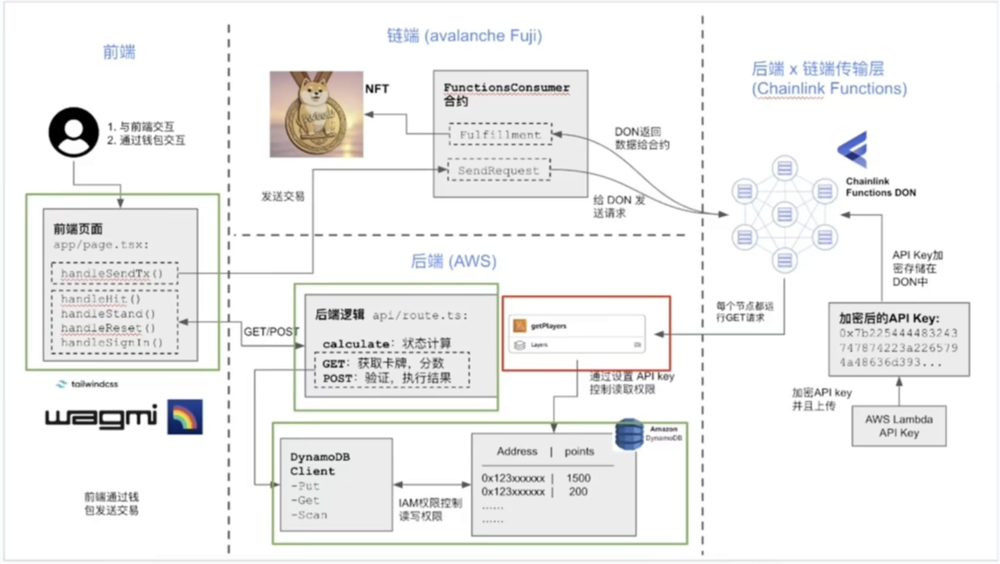

# DynamoDb数据库

1、在AWS中有一个dynamoDB的table,table的名称是blackJack,partition key是player。在这个table
中存储了另一个变量score，请帮我写一段typescript的程序用来读和写该table。

其中的AWS_USER_ACCESS_KEY、AWS_USER_ACCESS_KEY_SECRET是来自于AWS的IAM账户，客户端可通过这两个秘钥对附属(Attached policies)到IAM的USER roles上的服务进行访问：

```typescript
import { DynamoDBClient } from "@aws-sdk/client-dynamodb";
import {
  DynamoDBDocumentClient,
  PutCommand,
  GetCommand,
} from "@aws-sdk/lib-dynamodb";

const client = new DynamoDBClient({
  region: "us-east-1",
  credentials: {
    accessKeyId: process.env.AWS_USER_ACCESS_KEY || "",
    secretAccessKey: process.env.AWS_USER_ACCESS_KEY_SECRET || "",
  },
});
const docClient = DynamoDBDocumentClient.from(client);
const TABLE_NAME = "blackJack";
const DEFAULT_PLAYER = "player";

async function getScore(player: string) {
  const params = {
    TableName: TABLE_NAME,
    Key: { player },
  };

  try {
    const result = await docClient.send(new GetCommand(params));
    return result.Item?.score as number;
  } catch (error) {
    throw new Error("Error getting score from DynamoDB: " + error);
  }
}

async function writeScore(player: string, score: number) {
  const params = {
    TableName: TABLE_NAME,
    Item: {
      player: player, // 分区键
      score: score, // 得分
    },
  };

  try {
    await docClient.send(new PutCommand(params));
  } catch (error) {
    throw new Error("Error writing score to DynamoDB: " + error);
  }
}
```

---

> 后续思路：
>
> 以一种lambda function的方式让我们存储在AWS---DynamoDB中的数据能给暴露给外部，可以通过http GET的方式被客户端外部直接获取到数据，为什么不继续使用后端逻辑让外部去获取，主要是因为后面会用区块链和web2的传输层，就是chainLink functions去获取web2的数据，然而它是一个分布式的获取数据的方式，所以每一个网络里面的节点都需要运行这个代码，就是会导致整个运行的环境是比较昂贵的，而且在运行的环境中无法引入第三方包的，比如说DynamoDB或者是其它AWS的SDK，在这种情况下只能是通过发送一个简单的GET或者POST请求获取到一些数据。
>
> 那我们现在就去制作这样的一个接口，在AWS中其实也有gateWay和其他的方式去做，这里选择Lambda functions，主要是考虑到AWS免费的服务中Lambda一定程度上是不收费的，所以我们选择它，接下来我们去构建一个新的Lambda functions。

# Lambda

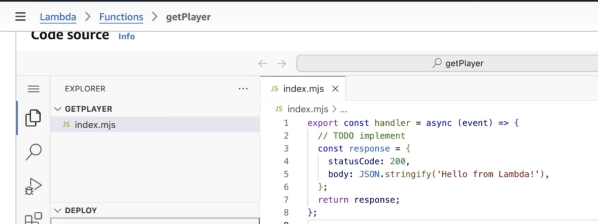

浏览器直接访问生成的URL就能得到对应返回的数据

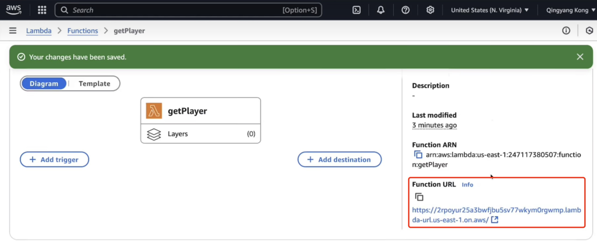

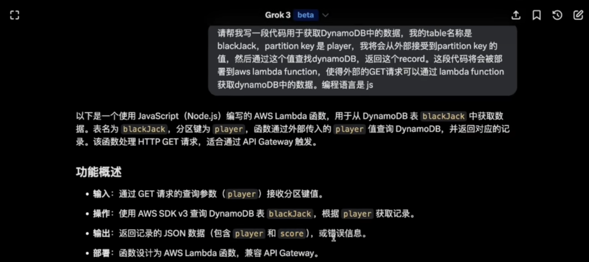

写出当前项目的DynamoDB数据获取，记得仍然需要将对应权限附属(Attached policies)到IAM的USER roles上，部署后通过常规链接获取数据。

# ChainLink Functions

和之前一个道理，链上存储更贵，重要信息放就行了，通过chainlink fucntions第三方服务经由lambda，让智能合约获取到DynamoDB中的数据。

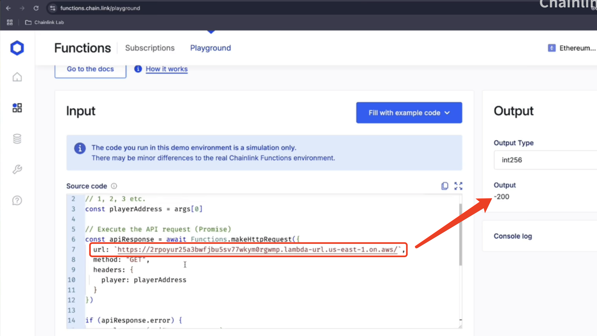

# 写合约

合约中要包含chainlink fucntions的对应代码片段，合约对应可以获取到DynamoDB的数据。

大部分合约读取线下的一些数据，都会有一个apikey，

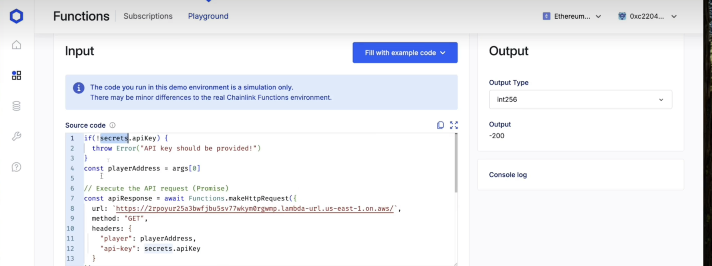

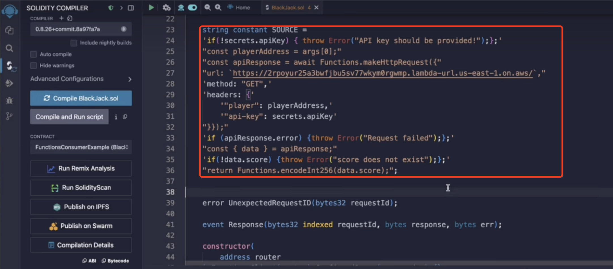

合约的apikey获取，

1、存在某个普通服务里面，允许chainlink去调用(lambda一个道理，一个普通链接)

2、直接传给DON去中心化网络，再获取，其实就是先加密再上传（对应脚本）

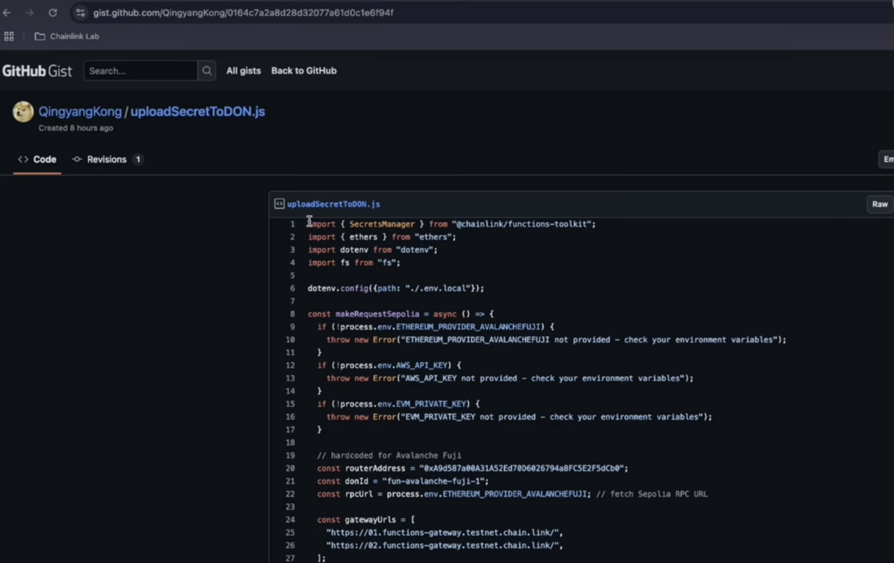

## 支持mint一个NFT

[https://docs.openzeppelin.com/contracts/5.x]()

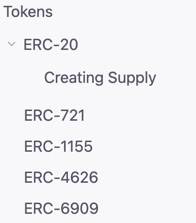

通过[filebase](https://console.filebase.com/login)存储对应的NFT的metaData。

# 订阅合约

在chainlink中订阅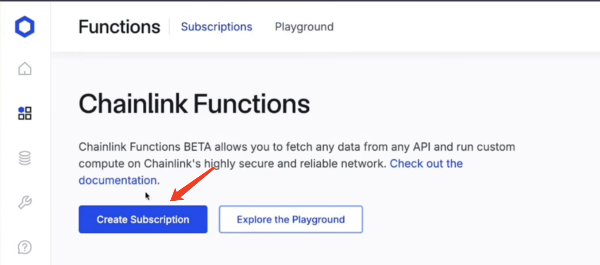

填入部署的合约地址，合约才可以给chainlink发请求获取数据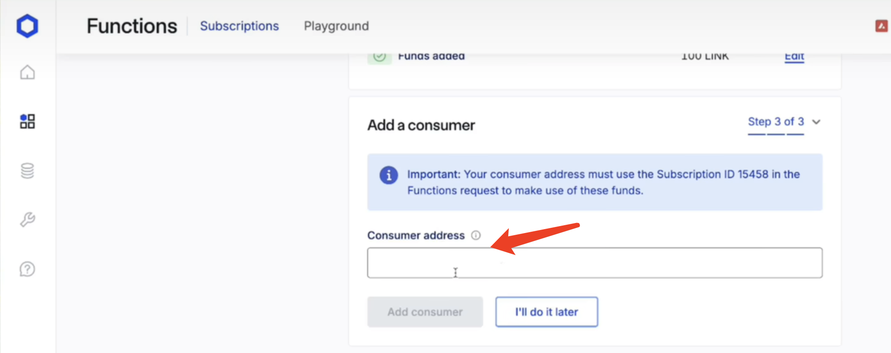

前端交互mint

这里的functionName: 'sendRequest',就是合约里面的代码

```typescript
async function handleSendTx() {
  try {
    const contractAddr = process.env.NEXT_PUBLIC_CONTRACT_ADDRESS;
    const contractAbiRaw = process.env.NEXT_PUBLIC_CONTRACT_ABI || "";

    let contractAbi;

    try {
      contractAbi = parseAbi([contractAbiRaw]);
      console.log("Parsed ABI:", contractAbi);
    } catch (error) {
      console.error("Error parsing ABI:", error);
      setMessage("Invalid ABI JSON format");
      return;
    }

    if (!contractAddr || !contractAbi) {
      console.error("Contract address or ABI is not defined");
      return;
    }
    const args = [address];

    const { request } = await publicClient.simulateContract({
      address: contractAddr as `0x${string}`,
      abi: contractAbi,
      functionName: "sendRequest",
      args: [args, address],
      account: address,
    });

    const txHash = await walletClient.writeContract({
      address: contractAddr as `0x${string}`,
      abi: contractAbi,
      functionName: "sendRequest",
      args: [args, address],
      account: address,
    });
  } catch (error) {
    console.error("Error sending transaction:", error);
  }
}
```
